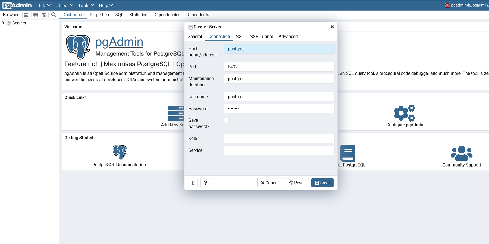
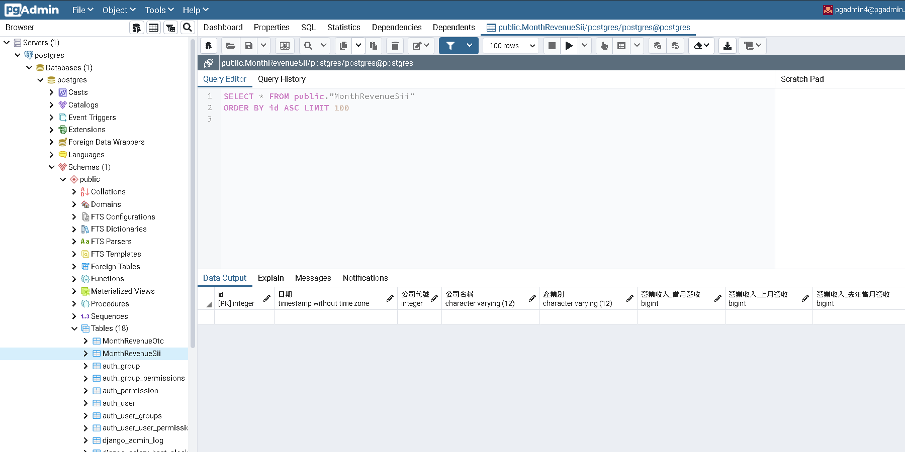

# django-celery-stock-crawler

股票自動爬蟲資料庫

 

### **目前功能**
  - docker-compose部屬，並用volume掛載下載結果
  - 使用django restframework做backend
  - celery爬蟲，目前只放月營收
  - celery beat定時觸發爬蟲任務
  - celery flower 監控爬蟲任務成敗
  - 將結果儲存至postgressql
  - pgadmin4界面化讀取postgressql
  
### **使用工具**
 - Django rest framework
   - Celery 
   - uwsgi
 - sqlachemy
 - supervisor
 - Redis 
 - Docker
 - NGINX


### **使用方法**

**連接資料庫**

首先用docker-compose快速部屬，首先要連接資料庫。輸入網址localhost/pgadmin4/就有一個登入界面，帳號名密碼皆在docker-compose.yml裡，default帳戶名為pgadmin4@pgadmin.org,密碼admin。

```
docker-compose up
```

 
 
 登入成功，點擊add new server。
 
 

 填寫name，點擊navbar的connection。

 

 Hostname要輸入postgres而非localhost，因為pgadmin4也在包docker-compose裡面。username, password一樣在docker-compose.yml已有設定，分別為 postgres和changeme。

 

 連接完成，左邊的servers多了一個postgres server。

 

**初始化table**

在此資料夾外輸入下列指令產生月營收表格。crawl_app_web_1為docker容器名，輸入前先用docker ps -a看一下有無相同，容器名可以和container id替代。

```
bright2227@DESKTOP-UCTISJG:~/crawl_app$ docker exec -it crawl_app_web_1 python3 -m core.models create
```

點選表格，右鍵選取view rows可以直接讀取該表。

 

**設定爬取時間**

celery的爬取時間要到settings.py設定，拉到settings.py裡最下方。

```
bright2227@DESKTOP-UCTISJG:~/crawl_app/backend/crawl$ ls
asgi.py  celery.py  __init__.py  __pycache__  settings.py  urls.py  wsgi.py
```

分別為上櫃和上市月營收分別爬取，最後將檔案名排序後輸入資料庫。目前在省略處已經設定每月15號下午四點爬取。

為何不直接將檔案存入postgres是有原因的，如果直接異步儲存好幾個月份資料，有可能會讓較早的月份出更後面的primary key，會不利於建立以datetime為劃分的partition，資料庫不好優化讀取。 

```
CELERY_BEAT_SCHEDULE = {

    ...

    'test_beat_crawl_month_revenue_otc': {
        'task': 'crawlers.crawl_rev.request_month_revenue',
        'schedule': crontab(14, 13, day_of_month='29'),
        'args': (datetime.now().year, datetime.now().month, 'otc', 'non')
    },

    'test_beat_crawl_month_revenue_sii': {
        'task': 'crawlers.crawl_rev.request_month_revenue',
        'schedule': crontab(14, 13, day_of_month='29'),
        'args': (datetime.now().year, datetime.now().month, 'sii', 'non')
    },

    'test_beat_save_month_revenue': {
        'task': 'core.models.save_files',
        'schedule': crontab(15, 13, day_of_month='29'),
        'args': (2,4)
    },
    
    ...
    
    }
```

**監視爬取結果**

輸入網址localhost/flower，可在此即時監控celery爬取結果。

 

 
 
經過指定時間後，可發現資料已爬取。

 

 


**注意**

1. 當前celery版本和django結合有bug，CELERY_BEAT_SCHEDULE的args至少要兩個參數才會執行，如果只有一個如'args': (2)則會報錯，flower監控只會出現兩個task。

2. 證交所主是擋IP，使用proxypage獲得大量的proxy異步爬取，但proxy連線品質不穩定，可能會失敗個幾次。


